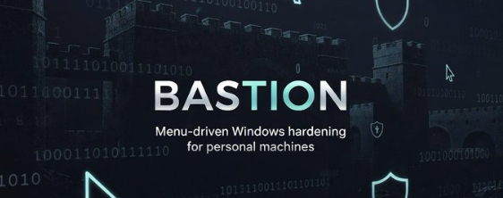
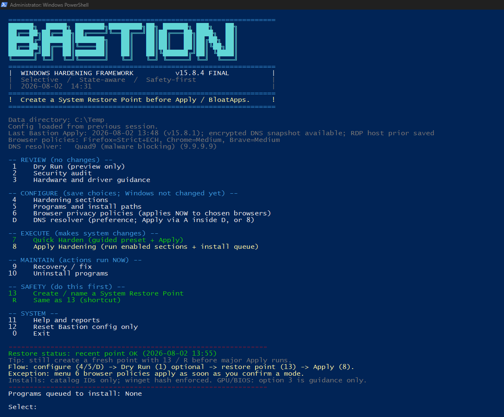
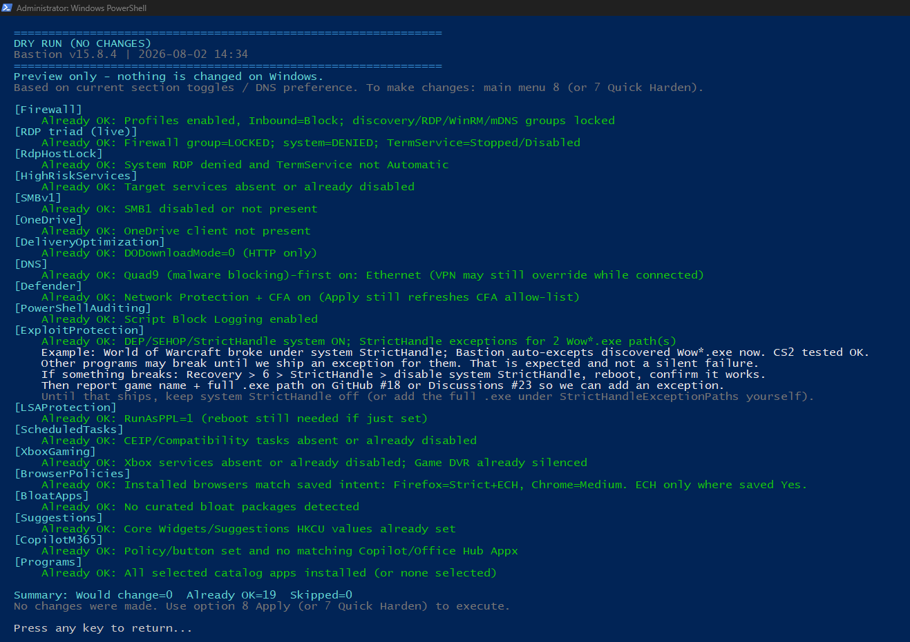
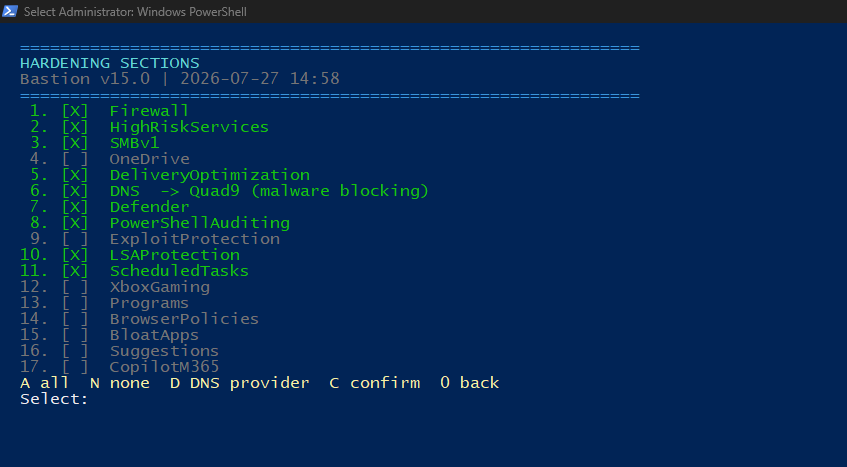
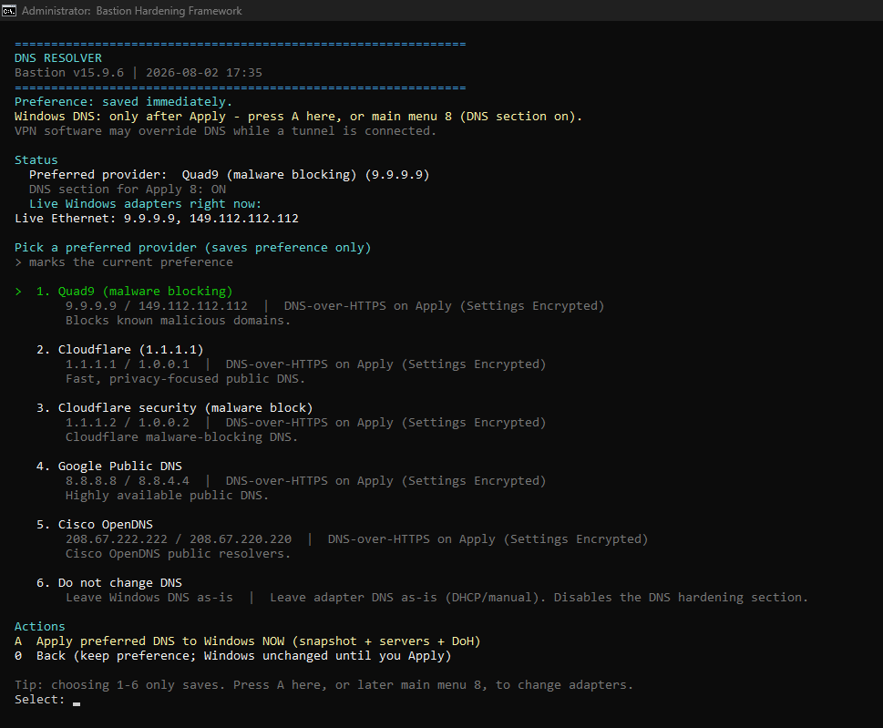
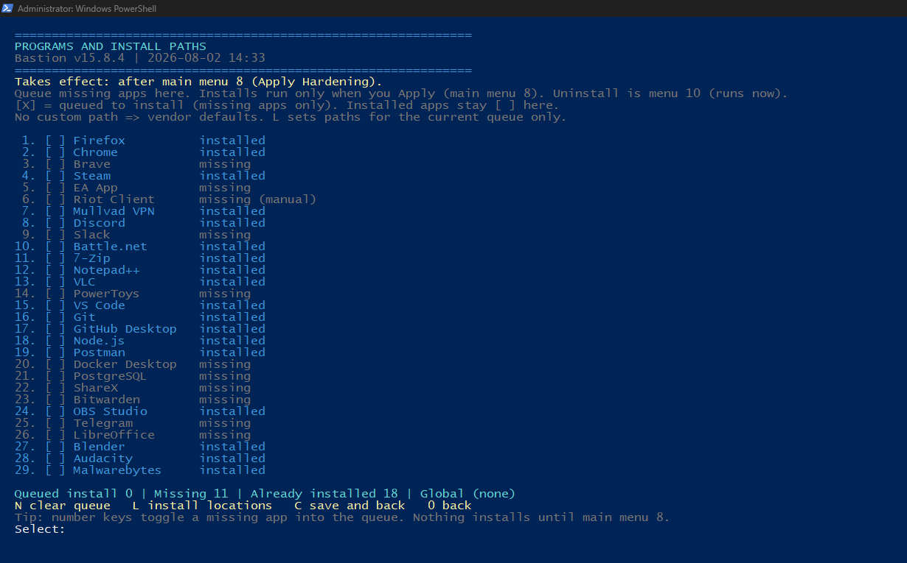
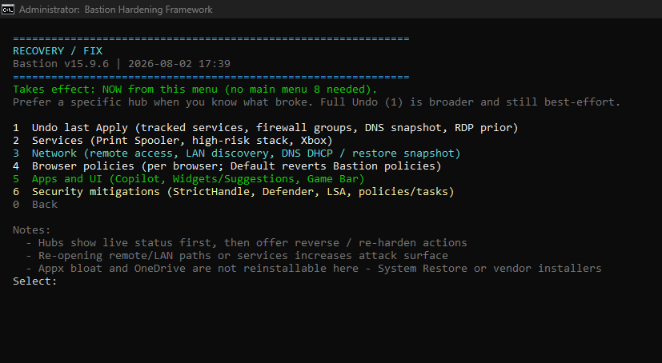
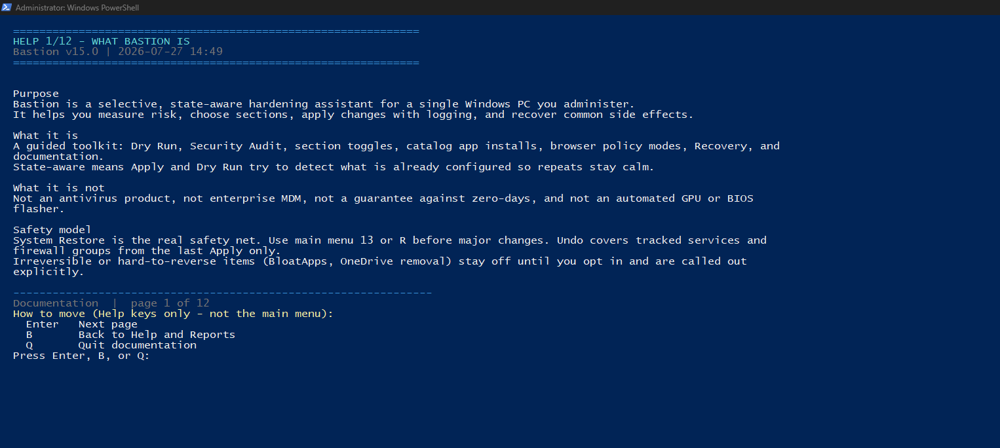

# Bastion Hardening Framework

**Selective - State-aware - Safety-first Windows hardening for a personal workstation**

Version **15.8**

[](LICENSE)
[](#tested-on)
[](#how-to-install-properly)

<p align="center">
  
</p>

<p align="center">
  <a href="https://www.operationlockedin.com"><strong>Official site</strong></a> - <a href="https://www.operationlockedin.com/bastion/download"><strong>Download</strong></a> - <a href="#how-to-install-properly"><strong>Install guide</strong></a> - <a href="docs/wiki/Home.md"><strong>Handbook</strong></a> - <a href="#files-and-folders-bastion-creates"><strong>Data directory</strong></a> - <a href="#known-issues"><strong>Known issues</strong></a> - <a href="#browser-policies"><strong>Browser / ECH</strong></a> - <a href="https://github.com/jjames06/bastion-hardening/releases/latest"><strong>Latest release</strong></a> - <a href="https://github.com/jjames06/bastion-hardening/wiki"><strong>Wiki</strong></a> - <a href="https://github.com/jjames06/bastion-hardening/discussions"><strong>Discussions</strong></a> - <a href="SECURITY.md"><strong>Security</strong></a>
</p>

**Further reading in this repo**

| Document | Topic |
|----------|--------|
| [Official site](https://www.operationlockedin.com) | Product home (Operation Locked In studio); Bastion product pages and download |
| [docs/wiki/Home.md](docs/wiki/Home.md) | **Handbook** - Quick start, Recovery cookbook, StrictHandle, FAQ (ships in the zip) |
| [GitHub Wiki](https://github.com/jjames06/bastion-hardening/wiki) | Same handbook on the Wiki tab (synced from `docs/wiki/`) |
| [docs/DATA-DIRECTORY.md](docs/DATA-DIRECTORY.md) | What folders/files Bastion creates, where, and why |
| [docs/BROWSER-POLICIES-AND-ECH.md](docs/BROWSER-POLICIES-AND-ECH.md) | Per-browser modes and Encrypted Client Hello (ECH) - never default |
| [SECURITY.md](SECURITY.md) | Vulnerability reporting and safe usage |
| In-app Help (menu **11**) | Full guided documentation, including live data-directory path |

---

## Screenshots

Main menu (review, configure, apply, safety):



Dry Run - state-aware preview, no changes applied:



Hardening sections - toggle only what you want (DNS shows the chosen provider):



DNS resolver - Quad9, Cloudflare, Google, OpenDNS, or leave DNS unchanged:



Programs and install paths - catalog apps via winget; selection is opt-in (nothing forced):



Recovery / fix - modular hubs (not a long flat list): Undo, **Services**, **Network**, browsers, **Apps and UI**, **Security mitigations**:



Built-in help (scope, safety model, section docs):



---

## Tested on

Verified by the maintainer on a personal daily-driver PC (not a lab matrix of every SKU):

| OS | Build | Arch | Bastion | Notes |
|----|-------|------|---------|--------|
| **Windows 11 Pro** | **10.0.26200** (build **26200**) | 64-bit | **v15.8** | GPLv3; modular Recovery hubs; encrypted DNS/RDP undo; optional RdpHostLock; handbook/wiki; as of 2026-08-02 |

Also intended for **Windows 10** (same script surface). If you run Bastion on a build not listed here, please report success or issues in [Discussions -> Testing feedback](https://github.com/jjames06/bastion-hardening/discussions) or [Issues](https://github.com/jjames06/bastion-hardening/issues).

**Not tested / not supported:** domain-joined, Intune/MDM-managed, Windows Server, ARM-specific edge cases (may still run; report results).

---

## Critical warnings

Read these before you run anything:

- **Requires Administrator privileges**
- Makes real system changes (services, firewall, registry, AppX packages, DNS, Defender, and more)
- **Create a System Restore Point** before Apply or Quick Harden
- **ExploitProtection** enables system **StrictHandle**. That can break some programs. **World of Warcraft** is a documented *example* that broke (Bastion now auto-excepts discovered `Wow*.exe`). **CS2** tested OK. **Other titles may still break** until someone reports them and we ship an exception. Reverse properly: Recovery -> **6** -> StrictHandle -> disable system StrictHandle -> **reboot** -> confirm -> **report** game + full `.exe` path on [issue #18](https://github.com/jjames06/bastion-hardening/issues/18) or [Discussions #23](https://github.com/jjames06/bastion-hardening/discussions/23). Details: [Known issues](#known-issues)
- Disabling Xbox services / removing **Xbox Gaming Overlay** without silencing **Game DVR** can make games show *Get an app to open this ms-gamingoverlay link* - Bastion now silences Game DVR when XboxGaming or overlay removal runs (Recovery -> **5** -> Game Bar)
- **Firewall Apply** disables remote and LAN discovery inbound groups. Re-open only if needed: Recovery -> **3 Network** (remote access, LAN/discovery, DNS reset or restore prior snapshot). Opening those paths increases attack surface.
- **RdpHostLock** (optional section, **off by default**) denies this PC as an RDP host (system policy + TermService). Firewall already locks the Remote Desktop **group** by default; the host lock is separate and reversible via Recovery or Undo.
- Can break printing (Print Spooler), network discovery, remote desktop / remote management, OneDrive sync, Xbox features, Widgets, and related functionality
- Intended **only** for a single personal PC you fully control
- **Not** for work, school, domain-joined, or MDM-managed devices
- This is **not** an antivirus and does **not** make a system unhackable

If you are not comfortable creating a restore point and recovering from broken features, **do not run this tool**.

---

## What Bastion is

A guided, selective hardening assistant for Windows 10/11 that lets you:

- Measure current posture (Dry Run and Security Audit)
- Choose exactly which areas to harden
- Apply changes with logging and limited undo
- Install a curated catalog of common applications via winget
- Recover common side effects (Print Spooler, browser policies, Widgets, and more)

## What Bastion is not

- Not an antivirus or complete security product
- Not an enterprise MDM / Group Policy replacement
- Not a reckless "one-click debloat everything" script
- Not a claim of zero-day protection

---

## Design principles

| Principle | Meaning |
|-----------|---------|
| **Selective** | Almost every section is optional |
| **State-aware** | Detects live Windows state before changing it; menu prefs live in a durable data directory (not faked Apply history) |
| **Safety-first** | Restore-point gate, soft failures, honest documentation |
| **Catalog-only installs** | No free-typed package IDs; never uses `--ignore-security-hash`; preflight does not print the full winget binary path |
| **Reversible where practical** | Tracked Undo (services, firewall groups, encrypted DNS snapshot, RDP host prior) plus modular Recovery hubs - single main-menu entry |
| **Honest on-disk state** | Sensitive Apply undo fields (DNS snapshot, RDP prior) are DPAPI-encrypted with a tight ACL; same elevating account can still decrypt (documented) |

System Restore remains the strongest rollback path.

---

## Requirements

- Windows 10 or Windows 11
- Administrator rights
- System Protection / System Restore enabled on the system drive (strongly recommended)
- [winget](https://learn.microsoft.com/windows/package-manager/winget/) (App Installer) recommended for the Programs section

---

## How to install (properly)

Bastion is **not** an MSI installer. You download the files, keep them together, and launch the elevated batch file. Nothing is registered as a Windows program until *you* choose optional winget installs inside the tool.

### Before you start

1. Use a **personal** PC you fully control (not work, school, domain-joined, or MDM-managed).
2. Prefer the **official site download**, a **GitHub release**, or this repository only - not random re-uploads.
3. Skim [LICENSE](LICENSE), [NOTICE](NOTICE), and the warnings at the top of this README.
4. Optionally read the script (`Bastion-Hardening.ps1`) before the first Apply.

### Method A - Official site or GitHub release zip (recommended)

Best for most people. Prefer one of these **official** sources only (not random re-uploads):

| Source | URL |
|--------|-----|
| **Official site (recommended)** | [www.operationlockedin.com/bastion/download](https://www.operationlockedin.com/bastion/download) - uses `/api/bastion/download` to resolve the same GitHub Latest zip |
| **GitHub Releases** | [github.com/jjames06/bastion-hardening/releases/latest](https://github.com/jjames06/bastion-hardening/releases/latest) |

Product overview and docs on the site: [www.operationlockedin.com/bastion](https://www.operationlockedin.com/bastion). Older pinned tags such as [v15.3](https://github.com/jjames06/bastion-hardening/releases/tag/v15.3) / v15.2 remain on GitHub if you need them.

1. Download **`bastion-hardening-v15.8.zip`** (or the current release asset with a similar name) from the official site or GitHub Latest.
2. Right-click the zip -> **Properties** -> if you see **Unblock**, check it -> **OK**  
   (reduces SmartScreen / "downloaded from the internet" friction on the extracted scripts)
3. Extract the zip to a location **you** control, for example `C:\Tools\`.  
   Official release zips expand to a **single folder** such as  
   `bastion-hardening-v15.8\` with all product files already together inside.  
   Avoid extracting into `C:\Windows` or Program Files.
4. Open that folder and confirm these files sit together:

   | File | Required? |
   |------|-----------|
   | `Bastion-Hardening.bat` | Yes - launcher |
   | `Bastion-Hardening.ps1` | Yes - main script |
   | `Bastion-Banner.utf8.txt` | Optional (banner only) |
   | `LICENSE`, `NOTICE`, `README.md`, `SECURITY.md`, `docs\` | Optional at runtime |

5. **Do not** double-click the `.ps1` file. Use the batch launcher:
   - Right-click **`Bastion-Hardening.bat`**
   - Choose **Run as administrator**
   - Accept the UAC prompt
6. When the Bastion menu appears, go to **How to run Bastion the first time** below.

### Method B - Git clone

For people who already use Git and want easy updates.

```powershell
git clone https://github.com/jjames06/bastion-hardening.git
cd bastion-hardening
```

Then right-click **`Bastion-Hardening.bat`** -> **Run as administrator** (same as Method A, step 6).

To update later:

```powershell
cd bastion-hardening
git pull
```

### Method C - Download ZIP from the Code button

GitHub **Code -> Download ZIP** works, but the **Releases** zip is preferred (known version tag, release notes, checksums if you add them later).

If you use Code ZIP: extract, keep files together, launch `Bastion-Hardening.bat` as administrator - same rules as Method A.

### How to run Bastion the first time

On the **first elevated launch**, Bastion automatically:

- Creates a **writable data directory** (prefer `C:\Temp\Bastion`; reuses any existing Bastion state folder; falls back to `%ProgramData%\Bastion`, `%LOCALAPPDATA%\Bastion`, then wipeable `%TEMP%\Bastion` only if needed)
- Seeds **`Bastion-Config.json`** with safe defaults (menu choices only; Encrypted Client Hello (ECH) flags stay **off**)
- Writes **`Bastion-Session.json`** from **live** detection (rewritten every launch)
- Does **not** invent **`Bastion-LastApply.json`** until you actually Apply
- Does **not** write browser enterprise policies or Encrypted Client Hello (ECH) until you use menu **6**

If you delete that folder later, the next run re-seeds defaults and re-detects the live system. Dry Run / Apply still judge Windows itself - they do not pretend a prior Apply happened. Full inventory: [docs/DATA-DIRECTORY.md](docs/DATA-DIRECTORY.md).

After the elevated menu opens:

1. Confirm the **Data directory** line on the main menu (and "First run..." or "No Bastion Apply recorded yet" when appropriate)
2. **13** or **R** - create a named System Restore Point  
3. **1** - Dry Run (preview only; no hardening applied; live OS detection)  
4. **2** - Security Audit (optional posture sample, including installed browsers)  
5. **4** - enable only sections you understand  
6. **5** - select programs only if you want installs (none are pre-selected)  
7. **6** (optional) - browser policies for **installed** Firefox / Chrome / Brave only; Encrypted Client Hello (ECH) is a separate Yes/No under Strict and is never on by default  
8. **D** - DNS resolver, or leave DNS unchanged  
9. **7** Quick Harden or **8** Apply - type **YES** when asked  
10. Reboot if prompted (e.g. LSA Protection / some optional features)  
11. Run **Dry Run** again to verify  

### Common install / launch problems

| Symptom | What to try |
|---------|-------------|
| Nothing happens / window flashes | Run `Bastion-Hardening.bat` **as administrator**, not the `.ps1` alone |
| "scripts is disabled" / execution policy | The launcher uses `-ExecutionPolicy Bypass` for this script only. Use the `.bat`, not a locked-down host policy that blocks even elevated Bypass |
| SmartScreen / "Windows protected your PC" | Prefer Unblock on the zip (Method A step 2). More info -> Run anyway **only** if you trust the official site or this GitHub release |
| winget / Programs installs fail | Install **App Installer** from the Microsoft Store, open a new elevated window, retry |
| Files "not found" after extract | Keep `.bat` and `.ps1` in the **same** directory; do not run a shortcut that points elsewhere |
| Controlled Folder Access / AV blocks | Allow the script path temporarily, or run Dry Run first and apply in smaller steps |
| Lost menu prefs after cleanup | Prefer the durable data dir (`C:\Temp\Bastion` / ProgramData / LocalAppData). `%TEMP%\Bastion` can be wiped by Disk Cleanup |

### What Bastion does **not** install for you

- It does **not** add itself to Programs and Features as a permanent product installer  
- It does **not** flash BIOS or auto-install GPU drivers  
- Optional apps install **only** if you select them under Programs and run Apply  
- Logs/config live under a **data directory** shown on the main menu (prefer `C:\Temp\Bastion`; durable fallbacks before wipeable temp)

---

## Quick start (short)

1. Download the latest zip from the [official site](https://www.operationlockedin.com/bastion/download) or [GitHub Releases](https://github.com/jjames06/bastion-hardening/releases/latest) and extract it  
2. Right-click `Bastion-Hardening.bat` -> **Run as administrator**  
3. Create a System Restore Point (**13** / **R**)  
4. **Dry Run** first, then Apply or Quick Harden  

For full detail, use **[How to install (properly)](#how-to-install-properly)** above.

---

## Main sections

| Section              | Default | Notes                                           |
|----------------------|---------|-------------------------------------------------|
| Firewall             | On      | Inbound block, outbound allow + group hardening |
| HighRiskServices     | On      | Includes Spooler (PrintNightmare surface)       |
| SMBv1                | On      | Disables legacy SMB1                            |
| OneDrive             | On      | Removes desktop client only                     |
| DeliveryOptimization | On      | HTTP-only updates                               |
| DNS                  | On*     | User-chosen public resolver (default Quad9)     |
| Defender             | On      | Network Protection + Controlled Folder Access   |
| PowerShellAuditing   | On      | Script Block Logging                            |
| ExploitProtection    | On      | Mild, compatibility-safe mitigations            |
| LSAProtection        | On      | RunAsPPL (reboot required)                      |
| ScheduledTasks       | On      | Selected telemetry tasks                        |
| XboxGaming           | Off     | Optional                                        |
| Programs             | On      | Catalog-only winget installs (none pre-selected)|
| BrowserPolicies      | Off     | Per-browser modes; see [Browser policies](#browser-policies) |
| BloatApps            | Off     | Curated AppX removal                            |
| Suggestions          | Off     | Widgets / Start suggestions                     |
| CopilotM365          | Off     | Optional                                        |

\* DNS is enabled by default with **Quad9**, but you can pick another resolver or leave DNS alone (main menu **D**). Quick Harden asks whether to change DNS and which provider to use.

Quick Harden uses a safer subset and asks explicitly whether to keep the Print Spooler enabled and whether to change DNS. It does **not** apply browser policies or Encrypted Client Hello (ECH).

---

## Browser policies

Main menu **6** (or Recovery **4** Browser policies). Full detail: [docs/BROWSER-POLICIES-AND-ECH.md](docs/BROWSER-POLICIES-AND-ECH.md).

Only **installed** supported browsers appear: **Firefox**, **Chrome**, **Brave**. Missing engines are never listed.

| Mode | What it does |
|------|----------------|
| **Default** | Removes Bastion policies for that browser only (best-effort revert; backups kept under the data directory) |
| **Medium** | Privacy baseline (telemetry / tracking / cookies); usually fewer site breakages |
| **Strict** | Medium + HTTPS-Only. Does **not** enable Encrypted Client Hello (ECH) by itself |
| **ECH pack** | Optional second **Yes/No after Strict**, for the browsers you selected only |

### Encrypted Client Hello (ECH) - never on by default

**Encrypted Client Hello (ECH)** is a TLS privacy feature: when supported, it can hide the destination hostname in the TLS Client Hello from passive network observers. Bastion only applies an **ECH pack** if you answer **Yes** under Strict for the chosen **installed** browser(s).

Bastion will **not** enable Encrypted Client Hello (ECH) because you installed Bastion, installed a browser, chose Strict alone, ran Dry Run/Audit, or seeded first-run config. Fresh defaults keep ECH **off** for every browser. Quick Harden does **not** touch browser policies or ECH.

| Browser | When you answer ECH **Yes** under Strict |
|---------|------------------------------------------|
| **Firefox** | Locks ECH-related prefs in `distribution\policies.json`. Bastion never sets `DisableEncryptedClientHello` (that turns ECH off) |
| **Chrome / Brave** | Enterprise transport policies + Bastion ECH intent marker (`BastionEchLock`). Not the same preference model as Firefox |

**Compatibility (honest):** Strict HTTPS-Only can break plain HTTP, captive portals, and some SSO/embeds. Encrypted Client Hello (ECH) can break networks or middleboxes that mishandle it. Common pattern: one browser Strict (optional ECH) for daily use; another Medium/Default for awkward sites.

| Action | How |
|--------|-----|
| Revert one browser (and its ECH pack) | Menu **6** -> that browser -> **Default** |
| Bulletproof rollback | System Restore (menu **13** / **R**) |
| Verify after restart | Firefox `about:policies` - Chrome `chrome://policy` - Brave `brave://policy` |
| Dry Run / Security audit | Live vs saved mode and Encrypted Client Hello (ECH) for **installed** browsers only |

---

## Files and folders Bastion creates

Bastion is transparent about runtime artifacts. The **data directory path is shown on the main menu** every launch. Full reference: [docs/DATA-DIRECTORY.md](docs/DATA-DIRECTORY.md).

### Location (resolved automatically)

| Priority | Path | Role |
|----------|------|------|
| Prefer existing state | `C:\Temp\Bastion`, legacy `C:\Temp`, `%ProgramData%\Bastion`, `%LOCALAPPDATA%\Bastion`, then `%TEMP%\Bastion` | Reuse newest Bastion store if present and writable |
| New install | `C:\Temp\Bastion` -> ProgramData -> LocalAppData -> flat `C:\Temp` -> `%TEMP%\Bastion` last | Durable first; wipeable temp only if necessary |

Each candidate is **write-probed**. `%TEMP%\Bastion` can be removed by Disk Cleanup - prefer the durable paths.

### Contents of the data directory

| Item | When created | Purpose |
|------|--------------|---------|
| `Bastion-Config.json` | Seeded on **first elevated run** (or after the store is wiped) | Menu choices: sections, apps, DNS, browser **wanted** modes, ECH Yes/No flags |
| `Bastion-Session.json` | **Rewritten every launch** | Live vs wanted browser posture; whether prior config/Apply existed. Not Apply history |
| `Bastion-BrowserPolicies-State.json` | On init and after browser policy changes | Wanted + live modes, last policy change summary |
| `Bastion-LastApply.json` | **Only after a real Apply** | Undo tracking for services / firewall groups; **DPAPI-encrypted** DNS snapshot and RDP host prior when those sections ran; ACL SYSTEM + Administrators |
| `Bastion-Log-*.txt` | Each session | Session transcript |
| `Bastion-Report-*.html` | Only if you export from Help | Optional HTML snapshot |
| `BastionInstallers/` | On path ensure | Staging for optional install work |
| `browser-policy-backups/` | On path ensure; files when menu **6** overwrites policies | Snapshots before Bastion changes browser policies |

**Important:** Missing `Bastion-LastApply.json` means Bastion has no Apply undo data yet - **not** that Windows is unmodified. Dry Run and Apply still detect **live** Windows state. Deleting the data directory does **not** un-harden Windows or remove browser enterprise policies; use Recovery, per-browser Default, Uninstall, or System Restore.

### Outside the data directory (only when you choose features)

Examples: Firefox `policies.json`, Chrome/Brave policy registry keys, services, firewall, DNS, Defender, AppX, Event Log source `BastionHardening`, System Restore points you create. See in-app Help and [docs/DATA-DIRECTORY.md](docs/DATA-DIRECTORY.md).

---

## DNS resolvers

From main menu **D** (or Sections -> **D**), choose one of:

| Option | Primary / secondary | Notes |
|--------|---------------------|--------|
| **Quad9 (malware blocking)** | `9.9.9.9` / `149.112.112.112` | Default. Blocks known malicious domains |
| **Cloudflare (1.1.1.1)** | `1.1.1.1` / `1.0.0.1` | Privacy-focused public DNS |
| **Cloudflare security** | `1.1.1.2` / `1.0.0.2` | Cloudflare with malware blocking |
| **Google Public DNS** | `8.8.8.8` / `8.8.4.4` | Highly available public DNS |
| **Cisco OpenDNS** | `208.67.222.222` / `208.67.220.220` | Public OpenDNS resolvers |
| **Do not change DNS** | - | Leaves adapters on DHCP/manual settings |

A connected VPN may override these settings while the tunnel is up. That is expected.

---

## Important notes

- **Print Spooler** - Disabled by default for security. Quick Harden gives a clear choice to keep it.
- **OneDrive & BloatApps** - Hard to reverse. System Restore is the reliable recovery path.
- **Browser policies / Encrypted Client Hello (ECH)** - BrowserPolicies section defaults off. ECH is **never** applied unless you opt in under Strict for a selected installed browser. Strict HTTPS-Only and ECH can break some sites or networks. Details: [docs/BROWSER-POLICIES-AND-ECH.md](docs/BROWSER-POLICIES-AND-ECH.md).
- **Undo** - Restores tracked services, firewall groups, an **encrypted DNS snapshot** (when a DNS Apply stored one), and **RDP host prior** (when **RdpHostLock** ran) from the last Apply only (`Bastion-LastApply.json`). It does **not** reinstall AppX packages or OneDrive. Prefer Recovery hubs when you know what broke.
- **Recovery hubs (menu 9)** - One main-menu entry, six hubs with live status: **1** Undo - **2** Services (Spooler / high-risk / Xbox) - **3** Network (remote access, LAN discovery, DNS reset to DHCP, **restore prior DNS from snapshot**) - **4** Browser policies - **5** Apps and UI (Copilot, Widgets, Game Bar) - **6** Security mitigations (StrictHandle, Defender NP/CFA, DO / PS logging / LSA / CEIP tasks). Hubs can re-harden or soften without full Apply. Enabling remote/LAN paths or services increases attack surface; Appx/OneDrive still need Store or System Restore.
- **DNS** - Optional. Choose a provider or leave DNS unchanged. Before Bastion changes adapter DNS, it snapshots prior IPv4 servers and stores them **DPAPI-encrypted** for Undo / Network recovery option **4**. VPN software may still override while connected.
- **RDP triad / RdpHostLock** - Dry Run and Security Audit report firewall Remote Desktop group + system `fDenyTSConnections` + TermService. Optional section **RdpHostLock** (off by default) denies the OS host switch on Apply; prior state is encrypted for Undo.
- **Custom install paths** - Only allowed on fixed local volumes outside system directories.
- **Logs and config** - Live under the **data directory** shown on the main menu (prefer `C:\Temp\Bastion`; durable fallbacks; `%TEMP%\Bastion` last). Full file list: [docs/DATA-DIRECTORY.md](docs/DATA-DIRECTORY.md).

---

## Known issues

Tracked on GitHub. Full write-up: [docs/KNOWN-ISSUES.md](docs/KNOWN-ISSUES.md).

### Before you enable ExploitProtection (StrictHandle)

**Setting:** system-wide **StrictHandle** (strict handle checks) via Windows process mitigations.

**Why software can break:** StrictHandle makes certain invalid or short-lived handle uses **fatal**. Some loaders and multi-process games do that during early startup and are fine under default Windows policy. With system StrictHandle **ON** and **no per-app exception**, the process can exit immediately.

**Example (not the only case): World of Warcraft.** Battle.net worked; **Play** / `Wow.exe` failed with **Eidolon** and Crash.txt **`INVALID_HANDLE`** in **`Wow_loader.dll`**. That is a **mitigation compatibility** issue - not a claim about Blizzard product intent. Bastion now **auto-excepts** discovered `Wow*.exe`. **CS2** was tested OK. **Any other title may still break** until it has an exception in Bastion.

**What Bastion does**

- **StrictHandle ON** for the system (security).
- **StrictHandle OFF** only for **known exception EXEs** (today: discovered `Wow*.exe`, plus any full paths you list in `StrictHandleExceptionPaths`).
- Everything else stays under system StrictHandle.

**If a program breaks after Apply**

1. **Preferred:** Recovery -> **6 Security mitigations** -> **StrictHandle** -> **disable system StrictHandle**, then **reboot**.
   Or keep system protection and add the full `.exe` under `StrictHandleExceptionPaths` in `Bastion-Config.json`, then refresh exceptions / re-Apply.
2. Confirm the program works again.
3. **Report it** (game name, fail mode, **full `.exe` path**) so we can ship an automatic exception:
   - [Issue #18](https://github.com/jjames06/bastion-hardening/issues/18), or
   - [Discussions #23 - Game compatibility reports](https://github.com/jjames06/bastion-hardening/discussions/23)
4. **Until that exception ships**, keep system StrictHandle off (or keep your manual path exception). After a Bastion update includes it, re-Apply or Recovery -> 6 -> re-enable system StrictHandle + exceptions.

Dry Run, Apply, and Recovery use the same guidance. Full detail: [docs/KNOWN-ISSUES.md](docs/KNOWN-ISSUES.md).

---

## Repository layout

| Path | Purpose |
|------|---------|
| `Bastion-Hardening.ps1` | Main script (hardening, menus, data store, help) |
| `Bastion-Hardening.bat` | Elevated launcher |
| `Bastion-Banner.utf8.txt` | Optional Unicode banner |
| `LICENSE` | GNU GPLv3 (full license text) |
| `NOTICE` | Copyright, Bastion system-change disclaimer, prior MIT release note |
| `SECURITY.md` | Vulnerability reporting and safe-usage notes |
| `README.md` | This documentation |
| `docs/DATA-DIRECTORY.md` | Runtime files and folders Bastion creates |
| `docs/BROWSER-POLICIES-AND-ECH.md` | Browser modes and Encrypted Client Hello (ECH) |
| `docs/KNOWN-ISSUES.md` | Known issues and workarounds (e.g. WoW / StrictHandle) |
| `docs/images/` | Screenshots used in this README |

---

## Feedback and contributions

- **Testing feedback / "I ran this on ...":** [GitHub Discussions](https://github.com/jjames06/bastion-hardening/discussions) (see the **Testing feedback** thread)
- **Program/game broken after StrictHandle?** First reverse via Recovery -> **6** -> StrictHandle (disable system StrictHandle + reboot). Then comment on [issue #18](https://github.com/jjames06/bastion-hardening/issues/18) or [Discussions #23](https://github.com/jjames06/bastion-hardening/discussions/23) with **game name + full `.exe` path** so we can add an exception. WoW is only one known example; others may need the same treatment.
- **Bugs and feature requests:** open a [GitHub Issue](https://github.com/jjames06/bastion-hardening/issues)
- **Pull requests:** welcome for clear fixes and documentation improvements
- Maintained on a best-effort basis

When reporting a bug, include Windows version (**Settings -> System -> About** or `winver`), what you ran (Dry Run / Apply / Quick Harden), and relevant lines from the Bastion log under the log directory shown at exit.

---

## Maintainer: pack a release zip

Official assets should extract to **one folder** (not loose files at the zip root):

```powershell
# From the repo root (Windows PowerShell 5.1+ or pwsh)
powershell -NoProfile -ExecutionPolicy Bypass -File tools\pack-release.ps1 -Version 15.8
# Writes dist\bastion-hardening-v15.8.zip
# Upload that file as the GitHub Release asset (name must match bastion-hardening-v*.zip)
```

Layout inside the zip: `bastion-hardening-v15.8\Bastion-Hardening.bat` (and siblings). The site download API already allows that asset name pattern.

---

## Security

- Review the script before running it. Trust is earned by reading the code.
- Prefer the [official site](https://www.operationlockedin.com/bastion/download), official GitHub releases, or clones of this repository only.
- Do not run untrusted copies of Bastion from random downloads or chat attachments.
- Vulnerability reporting and supported versions: see [SECURITY.md](SECURITY.md).

---

## License

This project is licensed under the **GNU General Public License v3.0** (GPLv3).

- You may use, study, and modify Bastion under GPLv3. Redistribution (including commercial) is allowed only under GPLv3 with complete corresponding source for distributed modified works.
- If you **distribute** a modified version, you must also license it under GPLv3 and provide the **complete corresponding source code**. That is intentional: it keeps the project free software and blocks closed proprietary forks of Bastion itself.
- See [LICENSE](LICENSE) for the full GPLv3 text and [NOTICE](NOTICE) for the project copyright, additional system-change disclaimer, and prior-release note.

**Earlier published releases** that shipped with an MIT `LICENSE` file remain available under the license terms included in those release artifacts. Current `main` and future releases based on it use GPLv3.

**Use at your own risk.**

